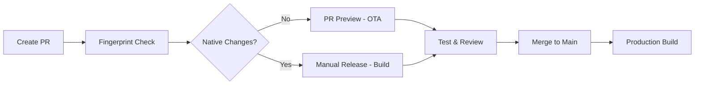

# GitHub Actions Workflows Documentation

Comprehensive CI/CD workflows for Reshme Info using Expo GitHub Action and EAS.

## 📋 Overview

This repository uses four specialized workflows for automated building, testing, and deployment:

1. **Production Build** - Automated Android APK builds on main branch
2. **PR Preview** - EAS Update previews for pull requests
3. **Fingerprint Check** - Detect native code changes in PRs
4. **Manual Release** - Flexible manual deployment workflow

---

## 🚀 Workflow Details

### 1. Production Build (`android-build.yml`)

**Triggers:**
- Push to `main` branch (excluding docs and workflow files)
- Manual dispatch with profile selection

**Features:**
- ✅ Node.js 18.18.0 with npm caching
- ✅ Expo/EAS setup with caching enabled
- ✅ Automatic .env file creation from secrets
- ✅ Local APK builds using EAS
- ✅ Artifact upload with 30-day retention
- ✅ Build summary with metadata

**Build Profiles Available:**
- `production` - Production release build
- `preview` - Preview/staging build
- `development` - Development build with debugging

**Usage:**
```bash
# Automatic on push to main
git push origin main

# Manual dispatch
# Go to Actions → Production Build → Run workflow
# Select desired profile (production/preview/development)
```

**Outputs:**
- APK artifact: `app-release-{run_number}`
- Build summary with commit info

---

### 2. PR Preview (`pr-preview.yml`)

**Triggers:**
- Pull request opened/synchronized/reopened to `main` or `develop`

**Features:**
- ✅ Automatic EAS Update creation per PR
- ✅ Branch-specific updates: `pr-{number}`
- ✅ QR code comment on PR for testing
- ✅ Environment variable injection
- ✅ Fast preview deployment (OTA updates)

**How it Works:**
1. PR is created/updated
2. Workflow runs `eas update --auto`
3. Update published to branch `pr-{PR_number}`
4. Comment posted with QR code and preview link
5. Scan QR with Expo Go or dev client to test

**Testing the Preview:**
1. Open the PR on GitHub
2. Find the EAS Update comment
3. Scan the QR code with:
   - Expo Go app (for Expo SDK apps)
   - Custom dev client (for apps with native modules)
4. Changes load instantly without rebuilding

---

### 3. Fingerprint Check (`fingerprint-check.yml`)

**Triggers:**
- Pull request opened/synchronized/reopened to `main` or `develop`

**Features:**
- ✅ Detects native code changes using `@expo/fingerprint`
- ✅ Compares current PR against base branch
- ✅ Automatic PR comments when rebuild needed
- ✅ Fingerprint database caching
- ✅ Detailed diff reporting

**What Gets Detected:**
- Native module installations
- Android/iOS native code changes
- Native configuration updates (app.json)
- Gradle/Podfile modifications
- Asset changes requiring rebuild

**Workflow Logic:**
```
No native changes → ✅ OTA update sufficient (use PR Preview)
Native changes detected → ⚠️ New build required (comment posted)
```

**Example Output:**
```
⚠️ Native Changes Detected
This PR includes changes that affect the native project.

Fingerprint Diff:
{
  "android": {
    "gradle": ["changed"],
    "manifest": ["unchanged"]
  }
}

Action Required: Create a new build with `eas build`
```

---

### 4. Manual Release (`manual-release.yml`)

**Triggers:**
- Manual workflow dispatch only

**Features:**
- ✅ Multi-platform builds (Android/iOS/Both)
- ✅ Profile selection (production/preview/development)
- ✅ Local or cloud builds
- ✅ Optional EAS Update creation
- ✅ Custom update messages
- ✅ Parallel platform builds

**Input Parameters:**

| Parameter | Type | Options | Description |
|-----------|------|---------|-------------|
| `platform` | choice | android/ios/all | Target platform(s) |
| `profile` | choice | production/preview/development | Build profile |
| `build_type` | choice | local/cloud | Build execution location |
| `create_update` | boolean | true/false | Also publish EAS Update |
| `update_message` | string | Any text | Update commit message |

**Usage Examples:**

**Android Production Build (Local):**
```yaml
platform: android
profile: production
build_type: local
create_update: false
```

**iOS + Android with Update:**
```yaml
platform: all
profile: production
build_type: cloud
create_update: true
update_message: "Release v1.2.0 - Bug fixes"
```

**Quick Preview Build:**
```yaml
platform: android
profile: preview
build_type: local
create_update: true
update_message: "Testing new feature"
```

---

## 🔐 Required Secrets

Configure these in **Settings → Secrets and variables → Actions**:

### Core Secrets
- `EXPO_TOKEN` - Expo account token for EAS CLI
  - Generate at: https://expo.dev/accounts/[username]/settings/access-tokens

### Firebase Configuration
- `EXPO_PUBLIC_FIREBASE_API_KEY`
- `EXPO_PUBLIC_FIREBASE_AUTH_DOMAIN`
- `EXPO_PUBLIC_FIREBASE_PROJECT_ID`
- `EXPO_PUBLIC_FIREBASE_STORAGE_BUCKET`
- `EXPO_PUBLIC_FIREBASE_MESSAGING_SENDER_ID`
- `EXPO_PUBLIC_FIREBASE_APP_ID`

### Admin Credentials (3 sets)
- `EXPO_PUBLIC_ADMIN_USERNAME_{1-3}`
- `EXPO_PUBLIC_ADMIN_PASSWORD_{1-3}`
- `EXPO_PUBLIC_ADMIN_ROLE_{1-3}`
- `EXPO_PUBLIC_ADMIN_MARKET_{1-3}`

### Backend
- `EXPO_PUBLIC_BACKEND_URL`

### GitHub Token
- `GITHUB_TOKEN` - Automatically provided by GitHub Actions

---

## 📊 Workflow Comparison

| Feature | Production Build | PR Preview | Fingerprint Check | Manual Release |
|---------|-----------------|------------|-------------------|----------------|
| **Trigger** | Push to main | Pull Request | Pull Request | Manual |
| **Build Type** | Full APK | OTA Update | Analysis only | Configurable |
| **Speed** | 30-60 min | 5-10 min | 2-5 min | 15-60 min |
| **Artifact** | APK file | Update bundle | Report | APK/IPA |
| **Testing** | Download APK | Scan QR code | N/A | Download build |
| **Use Case** | Releases | PR testing | Change detection | Ad-hoc releases |

---

## 🔄 Recommended Workflows

### Development Cycle



### Release Process

1. **Feature Development**
   - Create feature branch
   - Open PR to `develop` or `main`
   - Fingerprint check runs automatically

2. **Testing**
   - If OTA-compatible → Use PR Preview workflow
   - If native changes → Run Manual Release workflow
   - Test via QR code or downloaded build

3. **Production Release**
   - Merge PR to `main`
   - Production Build workflow triggers
   - APK artifact generated
   - Optional: Run Manual Release for EAS Update

---

## 🛠️ Expo GitHub Action Features Used

### Core Action (`expo/expo-github-action@v8`)

**Inputs:**
- `token` - EXPO_TOKEN for authentication
- `eas-version` - EAS CLI version (latest)
- `expo-cache` - Enable Expo caching (true)
- `packager` - Package manager (npm)

**Benefits:**
- ✅ Automatic Expo/EAS CLI installation
- ✅ Built-in caching for faster runs
- ✅ Token management for authentication
- ✅ Version pinning support

### Preview Action (`expo/expo-github-action/preview@v8`)

**Features:**
- ✅ Runs `eas update --auto`
- ✅ Posts QR code comment on PR
- ✅ Branch-based update organization
- ✅ Automatic cleanup on PR close

### Fingerprint Action (`expo/expo-github-action/fingerprint@v8`)

**Inputs:**
- `github-token` - PR comment permissions
- `packager` - npm/yarn/bun
- `working-directory` - Project location
- `fingerprint-version` - Fingerprint CLI version
- `fingerprint-installation-cache` - Cache fingerprint tools
- `fingerprint-db-cache-key` - Database cache key

**Outputs:**
- `previous-fingerprint` - Base commit fingerprint
- `current-fingerprint` - PR commit fingerprint
- `fingerprint-diff` - JSON diff of changes
- `previous-git-commit` - Base commit hash
- `current-git-commit` - Current commit hash

---

## 📈 Performance Optimizations

### Caching Strategy
```yaml
# Node modules caching
uses: actions/setup-node@v4
with:
  cache: 'npm'

# Expo caching
uses: expo/expo-github-action@v8
with:
  expo-cache: true

# Fingerprint caching
fingerprint-installation-cache: true
```

### Build Speed Improvements
- **npm ci** instead of npm install (faster, deterministic)
- **Local builds** for faster iteration (no queue time)
- **Artifact compression** disabled for APKs (already compressed)
- **Parallel jobs** for multi-platform builds

### Resource Management
- **Timeout limits** to prevent hung jobs
- **Artifact retention** of 30 days (cleanup)
- **Conditional job execution** (skip unnecessary steps)

---

## 🐛 Troubleshooting

### Build Failures

**Problem: EXPO_TOKEN invalid**
```
Error: Authentication failed
```
**Solution:**
1. Regenerate token at https://expo.dev/accounts/[username]/settings/access-tokens
2. Update `EXPO_TOKEN` secret in GitHub
3. Re-run workflow

**Problem: Dependencies installation fails**
```
npm ERR! network request failed
```
**Solution:**
- Check network status
- Clear npm cache: Add step `npm cache clean --force`
- Retry the workflow

### PR Preview Issues

**Problem: QR code comment not appearing**
```
Error: pull-requests: write permission required
```
**Solution:**
```yaml
permissions:
  contents: read
  pull-requests: write  # Add this
```

**Problem: Update not loading in app**
```
Update is not compatible with build
```
**Solution:**
- Native changes detected
- Run full build instead of OTA update
- Check fingerprint workflow results

### Fingerprint False Positives

**Problem: Reports changes when none exist**
```
Fingerprint diff shows changes in node_modules
```
**Solution:**
- Ensure consistent Node version across environments
- Use `npm ci` instead of `npm install`
- Check `.gitignore` excludes generated files

---

## 📚 Additional Resources

### Expo Documentation
- [EAS Build](https://docs.expo.dev/build/introduction/)
- [EAS Update](https://docs.expo.dev/eas-update/introduction/)
- [Expo GitHub Action](https://github.com/expo/expo-github-action)
- [Fingerprint](https://docs.expo.dev/guides/fingerprinting/)

### GitHub Actions
- [Workflow Syntax](https://docs.github.com/en/actions/using-workflows/workflow-syntax-for-github-actions)
- [Encrypted Secrets](https://docs.github.com/en/actions/security-guides/encrypted-secrets)
- [Manual Triggers](https://docs.github.com/en/actions/using-workflows/manually-running-a-workflow)

### Best Practices
- [CI/CD with Expo](https://docs.expo.dev/build/automating-submissions/)
- [Testing Workflows](https://docs.expo.dev/build-reference/private-npm-packages/)

---

## 🔒 Security Best Practices

1. **Never commit secrets** - Always use GitHub Secrets
2. **Rotate tokens** - Regenerate EXPO_TOKEN periodically
3. **Limit permissions** - Use minimal required permissions
4. **Review PRs** - Check workflow changes carefully
5. **Monitor builds** - Check logs for suspicious activity

---

## 📝 Maintenance

### Regular Tasks
- [ ] Update Expo SDK versions quarterly
- [ ] Rotate EXPO_TOKEN annually
- [ ] Review and clean old artifacts
- [ ] Update Node.js version as needed
- [ ] Test workflows after major updates

### Version Updates
```yaml
# Update in all workflows
NODE_VERSION: '18.18.0'  # Current LTS
eas-version: latest       # Or pin specific version
```

---

## 📞 Support

**Issues with workflows:**
- Check [GitHub Actions logs](../../actions)
- Review [Expo Status](https://status.expo.dev/)
- File issue in repository

**Expo/EAS questions:**
- [Expo Forums](https://forums.expo.dev/)
- [Discord Community](https://chat.expo.dev/)
- [Documentation](https://docs.expo.dev/)

---

**Last Updated:** 2025-10-20
**Expo GitHub Action Version:** v8
**EAS CLI Version:** latest
**Node Version:** 18.18.0
